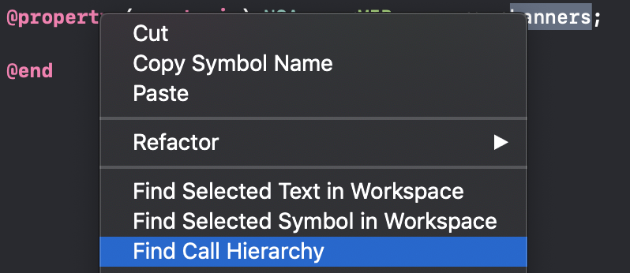

slidenumbers: true slide-transition: true

# [fit] The Great Swift Migration

---

# [fit] Self Intro

---

- Name: Josh Kaplan
- Company: GMO Pepabo
- App: minne
- Strengths: English
- Hobbies: Collecting Xcode versions

---

# [fit] 30,000 lines of Obj-C

^ 1.5 years

---

# [fit] Why?

---

- Future proofing 
- Safety 
- Productivity with features like generics, etc
- Security 

^ And until what point
^ being able to use latest version of libraries
^ SwiftUI, etc

---

# [fit] How?

---

# [fit] 1. Modernize Objective-C

^ Models in particular
^ ARC, etc
^ Nullability Annotations and Lightweight Generics
^ Why, how

---

```objectivec
@property (nonatomic, nonnull) NSArray<MICreator *> *creators;
@property (nonatomic, nonnull) MICartPayment *payment;
@property (nonatomic, nonnull) MIAPIClient *client;
@property (nonatomic, nullable) MICoupon *coupon;
```

---

# Check nullability in current Swift code



```swift
let num: Int? = nil
"\(num)" // String interpolation produces a debug description for an optional value
```

^ The dreaded "Optional()"

---

# Choosing which areas to migrate

- First, modernize models
- Then, ViewControllers and ViewModels/Presenters
    - Work on feature/module basis
- Avoid converting code that is then used in obj-c
- Cells and smaller views can wait

^ Convert your business logic
^ Calling Swift from obj-c is painful because of feature differences like enums, generics, structs, etc

---

# [fit] Details

---

# [fit] Steps

---

1. Move properties in m file to header and add annotations
2. Make Swift file and make extension
3. Migrate non-lifecyle methods and commit for each method
4. Make temporary method for lifecycle and IBAction method contents
5. Migrate lifecycle methods and properties
6. Update storyboard

^ Separate commits for each method is great for when 

---

# [fit] Points

---

- Only *minor* refactoring
- Writing tests first helps
- Communicate with team to prevent conflicts
- Things like major renaming should be in separate PRs to make review easier
- Set goals and monitor progress with tools like *tokei*

^ "brew install tokei", faster than cloc

---

# [fit] Bonus: Migrating to SwiftUI

---

- Small components
- Use Xcode Preview now
- Fewer dependencies
- Swift 😉
